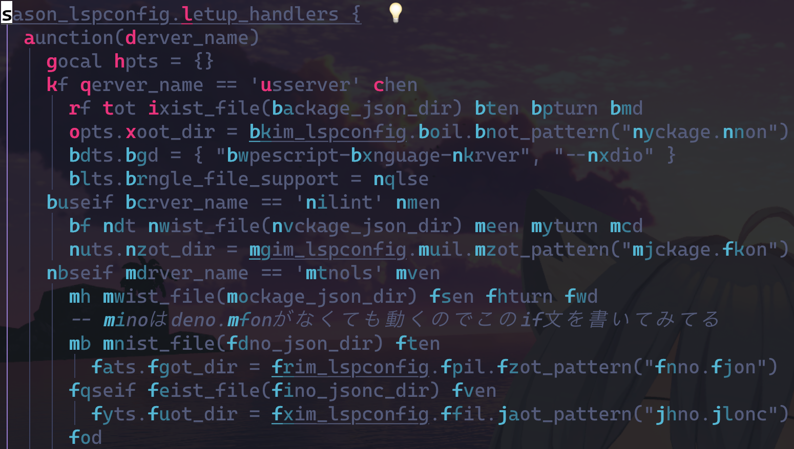
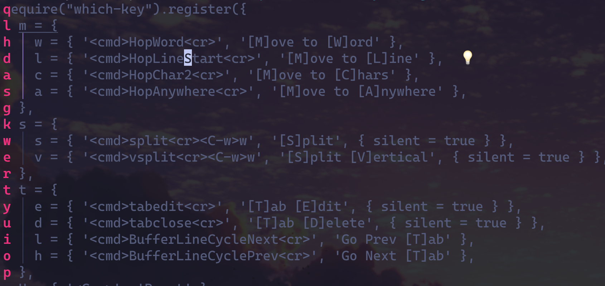

# Hop.nvim のすゝめ

See2et/しーぜっと

---

# 自己紹介

- 名前: See2et/しーぜっと
  - しーちゃん、しぜたんって呼ばれてます
- VRChat.vim の共同管理人
- Neovim の初心者ユーザ
- 好きな言語: TypeScript
  

---

# どうして Vim、使ってますか？

---

# 直感的な操作

### 単語を削除するとき...

- Others: カーソルでドラッグしてデリート
- Vim: Just type `dw`!

 

### → 両手両足 Vim

---

# カーソル移動、どうやってますか？

1. `{N}G`で行移動
1. 単語まで任意の方法で移動

以上のような方法が多いんじゃないでしょうか

---

# `{N}G`への不満点

1. 行番号を確認
1. `{N}G`を入力

→ 目線の移動と確認という作業が生まれてしまう！ 
= 両手両足 Vim が実現できていない！

---

# 実現したいこと

- 移動先から目を離したくない！

---

# Solution

- hop.nvim を使おう！

---

# How to use?

1. `:HopWord`を実行
1. 移動先の文字列を入力

---

# 行移動にも使えます

1. `:HopLine`を実行
1. 移動先の文字列を入力

他にも色々なオプションがある

---

# 実現できたこと

- 移動先に目線を固定したままカーソルを持っていける
- 基本的にホームポジションない数字キーの入力を避けれる

---

# あなたも hop.nvim を使いませんか？

- See [hop.nvim](https://github.com/phaazon/hop.nvim) and let's use it!

---

# ご清聴ありがとうございました！

- Contact me
  - X ~~Twitter~~: [@See2et](https://twitter.com/see2et)
  - Discord: @See2et
